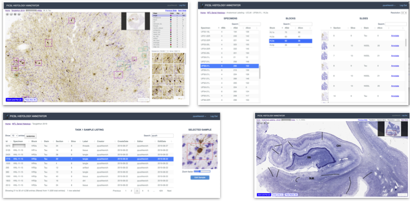

***************************************
PHAS: PICSL Histology Annotation Server
***************************************

PHAS (pronounced "phase") is a web-based application for visualization, annotation, and quantitative analysis of large histology datasets. It was developed by Paul Yushkevich and colleagues at the `Penn Image Computing and Science Laboratory at the University of Pennsylvania <https://picsl.upenn.edu/>`_. 

PHAS provides the following capabilities:

Digital Histology Archive
    PHAS provides web-based navigation, search, and visualization of large histology datasets stored either on a local RAID array or in cloud-based storage. Associated data, such as statitical maps generated by artificial intelligence (AI) algorithms can be overlaid on histology slides.

Anatomical Annotation: 
    PHAS can be used to visualize the histology sections and draw lines marking cytoarchitectural boundaries between brain subregions. The web-based architecture allows neuroanatomists at different institutions to annotate slides without downloading and uploading large files, with annotations stored in a central database and accessible using an API. The anatomical annotations features were used in `Ravikumar et al. (Nature Communications, 2024) <https://www.nature.com/articles/s41467-024-49205-0>`_ to construct a probabilistic atlas of the human medial temporal lobe.
 
Training Data Generation for Histopathology AI:
    PHAS allows concurrent annotation of objects, such as neurons or pathological inclusions, in histology. Objects are annotated by placing boxes around each object of interest and assigning it a label. Pathology experts can review and edit annotations by non-experts. Using a RESTful API, histology image patches and box boundaries can be downloaded and used to train weakly-supervised segmentation algorithms. This approach has been used in `Yushevich et al. (Brain 2021) <https://doi.org/10.1093/brain/awab262>`_ and `Ravikumar et al. (Nature Communications, 2024) <https://www.nature.com/articles/s41467-024-49205-0>`_ to construct 3D maps of tau neurofibrillary tangle pathology in the medial temporal lobe in the context of Alzheimer's disease. It was also used to study associations between in vivo cortical thickness and quantitative tau and TDP-43 pathology in `Denning et al. (Acta Neuropathologica 2024) <https://doi.org/10.1007/s00401-024-02789-9>`_. 

Sampling Regions for Quantitative Pathology:
    PHAS can be used to define sampling regions for quantifying the burden of pathology in specific structures, such as the load of TDP-43 pathology in the CA1 subfield of the hippocampus. This capability of PHAS was leveraged in `Denning et al. (Acta Neuropathologica 2024) <https://doi.org/10.1007/s00401-024-02789-9>`_. 

API and Associated Tools
    The PHAS RESTful API provides access to the metadata, image data, and annotations stored on a PHAS server. This facilitates data searches, training of AI algorithms, and quantification based on AI inference. 

PHAS remains under active development, but is ready for other labs to adopt. This documentation includes all the tutorials necessary to get started with PHAS.